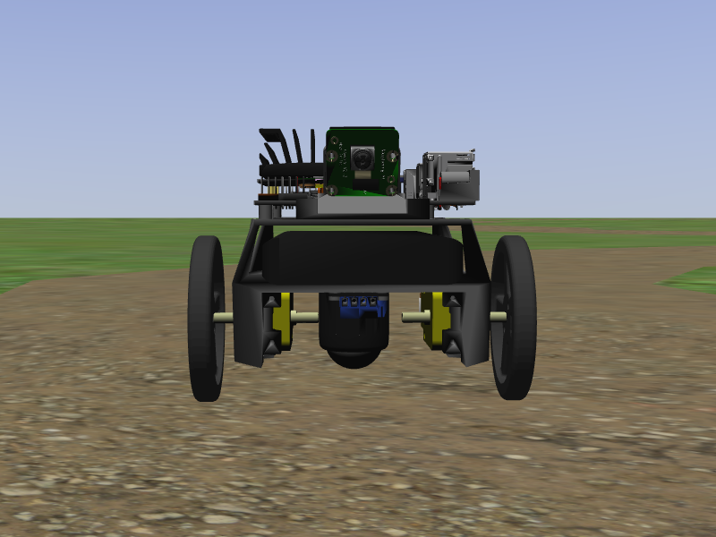
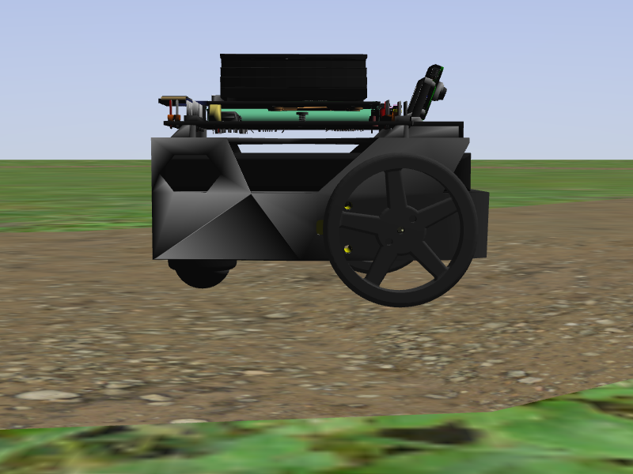

# jetbot_ros
ROS2 nodes and Gazebo model for NVIDIA JetBot with Jetson Nano

> note:  if you want to use ROS Melodic, see the [`melodic`](https://github.com/dusty-nv/jetbot_ros/tree/melodic) branch

🇺🇸 **[English](#english)** &nbsp;·&nbsp; 🇧🇷 **[Português](#português)**

---

## English

### Choose your setup

| Environment | When to use it | Section |
|---|---|---|
| **Jetson Nano** (real hardware) | You have a physical JetBot | [Jetson Nano (Docker)](#jetson-nano-docker) |
| **WSL2** (Windows 11, personal laptop) | Running the simulation on your own laptop | [WSL2 (personal laptop)](#wsl2-personal-laptop) |
| **Native Ubuntu 22.04** (VMware Workstation 17 VM) | Running it on the lab machines | [Ubuntu 22.04 VM (lab)](#ubuntu-2204-vm-lab) |

The WSL2 and lab VM options run **without Docker**, directly on top of ROS2 Humble + Gazebo Classic installed on the system — this repo's Docker images are built for L4T (Jetson/ARM64) and don't exist/work on x86_64.

---

### Jetson Nano (Docker)

#### Start the JetBot ROS2 Foxy container

``` bash
git clone https://github.com/dusty-nv/jetbot_ros
cd jetbot_ros
docker/run.sh
```

#### Run JetBot

If you have a real JetBot, you can start the camera / motors like so:

``` bash
ros2 launch jetbot_ros jetbot_nvidia.launch.py
```

or (for a Sparkfun Jetbot)
``` bash
ros2 launch jetbot_ros jetbot_sparkfun.launch.py
```

Otherwise, see the [`Launch Gazebo`](#launch-gazebo) section below to run the simulator.

#### Launch Gazebo

``` bash
ros2 launch jetbot_ros gazebo_world.launch.py
```

Then to run the following commands, launch a new terminal session into the container:

``` bash
sudo docker exec -it jetbot_ros /bin/bash
```

---

### WSL2 (personal laptop)

Prerequisites (one-time setup):
- Windows 11 with WSL2 + Ubuntu 22.04 (WSLg ships by default, which is what gives you GUI apps like Gazebo and RViz2 with zero extra config)
- ROS2 Humble installed in the distro. If you don't have it yet, follow the [official guide](https://docs.ros.org/en/humble/Installation/Ubuntu-Install-Debs.html) and then install the Gazebo packages:
  ```bash
  sudo apt update
  sudo apt install -y ros-humble-desktop ros-humble-gazebo-ros-pkgs \
      python3-colcon-common-extensions libgazebo-dev qtbase5-dev
  ```

#### 1. Clone and set up the workspace

```bash
git clone https://github.com/ItamarIliuk/jetbot_ros ~/JetBot/jetbot_ros
mkdir -p ~/ros2_ws/src
ln -s ~/JetBot/jetbot_ros ~/ros2_ws/src/jetbot_ros
```

#### 2. Build the ROS2 package

```bash
source /opt/ros/humble/setup.bash
cd ~/ros2_ws
colcon build --symlink-install --packages-select jetbot_ros
```

#### 3. Install the robot model in Gazebo

Gazebo needs to have run at least once already (so `~/.gazebo` exists):

```bash
timeout 10 gazebo --verbose > /dev/null 2>&1   # creates ~/.gazebo on first run
cd ~/JetBot/jetbot_ros/gazebo
./install_jetbot_model.sh
```

#### 4. Build the Gazebo camera plugin (optional)

The `user_camera_control_system` plugin is a standalone CMake project (not part of the colcon build). Without it the simulation still works fine, you'll just get a warning in the Gazebo log saying the `.so` wasn't found:

```bash
mkdir -p ~/JetBot/jetbot_ros/gazebo/plugins/build
cd ~/JetBot/jetbot_ros/gazebo/plugins/build
cmake .. && make -j$(nproc)
```

#### 5. Run it

```bash
source /opt/ros/humble/setup.bash
source ~/ros2_ws/install/setup.bash
ros2 launch jetbot_ros gazebo_world.launch.py
```

Leave that terminal running Gazebo, and for the next commands (teleop, RViz2, etc.) open **a new terminal** and re-run both `source` lines above before each command. Note that the overlay to source is the colcon workspace (`~/ros2_ws/install/setup.bash`), not a folder inside the repo — `Package 'jetbot_ros' not found` means that line is missing. To make it permanent:

```bash
echo 'source ~/ros2_ws/install/setup.bash --extend' >> ~/.bashrc
```

---

### Ubuntu 22.04 VM (lab)

Same steps as WSL2 (sections 1 through 5 above), with these VMware Workstation 17-specific differences:

- **3D acceleration**: in *VM Settings → Display*, check **Accelerate 3D graphics** and allocate at least 1–2 GB of video memory. Without this, Gazebo tends to render very slowly or freeze.
- **VMware Tools**: make sure `open-vm-tools-desktop` is installed (`sudo apt install -y open-vm-tools-desktop`) for the screen resolution and integration to work properly.
- **VM resources**: allocate at least 4 GB of RAM and 2 vCPUs — Gazebo is heavy.
- Since this is native Ubuntu (not WSL2), there's no WSLg equivalent needed: Gazebo/RViz2 windows just open normally on the VM's own desktop, no extra step required.

If the lab image already ships with ROS2 Humble and the Gazebo packages installed, skip straight to step 1 (clone and set up the workspace) in the WSL2 section above.

---

### Common usage (WSL2 and VM)

#### Robot model and launch arguments

`gazebo_world.launch.py` spawns the JetBot described in `urdf/jetbot.urdf.xacro` (the real JetBot v3 meshes from `gazebo/models/jetbot/meshes`, differential drive, front camera) through `robot_state_publisher`, so its TF tree and its 3D model are available to RViz2. Useful arguments:

```bash
ros2 launch jetbot_ros gazebo_world.launch.py world:=dirt_path.world           # another world from gazebo/worlds
ros2 launch jetbot_ros gazebo_world.launch.py x:=0.0 y:=0.0                    # spawn position
ros2 launch jetbot_ros gazebo_world.launch.py robot_model:=simple_diff_ros     # the old box-with-wheels SDF model
ros2 launch jetbot_ros gazebo_world.launch.py gui:=false                       # physics server only, no Gazebo window
```

If the Gazebo window shows up in the taskbar but never gets focus, or the launch complains that port 11345 is busy, a previous run is still alive — clear it and relaunch:

```bash
pkill -9 gzserver; pkill -9 gzclient
```

 

#### Test Teleop

The simplest approach that always works is running the node directly (without going through `ros2 launch`):

```bash
ros2 run jetbot_ros teleop_keyboard
```

> **Why not `ros2 launch jetbot_ros teleop_keyboard.launch.py`?** That launch file opens the node inside a separate terminal (`lxterminal`), which isn't installed by default outside the Jetson container. Even installing a terminal (`sudo apt install lxterminal`) doesn't fully fix it: `ros2 launch` proxies the child process's standard input, which breaks the teleop node's raw keyboard reads. Running it directly with `ros2 run` in your own terminal avoids that entirely.

The keyboard controls are as follows:

```
w/x:  increase/decrease linear velocity
a/d:  increase/decrease angular velocity

space key, s:  force stop
```

Press Ctrl+C to quit.

#### View the robot and its camera in RViz2

With `gazebo_world.launch.py` running, open RViz2 in another terminal with the bundled config (remember to source both setup files first):

```bash
rviz2 -d $(ros2 pkg prefix jetbot_ros)/share/jetbot_ros/rviz/jetbot.rviz
```

It comes preconfigured with the **RobotModel** (the JetBot meshes, from `/jetbot/robot_description`), **TF**, **Odometry** and the camera **Image** panel. To set it up by hand in a blank `rviz2` instead:

- **Fixed Frame**: `odom`
- **Add → RobotModel**, Description Topic `/jetbot/robot_description` (Durability Policy: *Transient Local*)
- **Add → Image** (raw 2D feed) **or Camera** (3D overlay), Topic `/jetbot/camera/image_raw`, Image Transport `raw`

The TF tree is `odom → base_footprint → chassis → left_wheel / right_wheel / camera_link → camera_optical_frame`. Images are stamped in `camera_optical_frame` (ROS optical convention), so the Camera display lines up with the 3D view.

#### Data Collection

``` bash
ros2 launch jetbot_ros data_collection.launch.py
```

> On Jetson (Docker), the dataset is saved to `/workspace/src/jetbot_ros/data/datasets/`. On WSL2/VM, it's saved to `~/JetBot/jetbot_ros/data/datasets/` (or wherever you cloned the repo).

It's recommended to view the camera feed via RViz2 (section above) or through Gazebo itself, by going to `Window -> Topic Visualization -> gazebo.msgs.ImageStamped` and selecting the `/gazebo/default/jetbot/camera_link/camera/image` topic.

Then drive the robot and press the `C` key to capture an image.  Then annotate that image in the pop-up window by clicking the center point of the path.  Repeat this all the way around the track.  It's important to also collect data of when the robot gets off-course (i.e. near the edges of the track, or completely off the track).  This way, the JetBot will know how to get back on track.

Press Ctrl+C when you're done collecting data to quit.

#### Train Navigation Model

Substitute the path of the dataset you collected (by default it's in a timestamped folder under `data/datasets/`, wherever you cloned the repo):

``` bash
cd ~/JetBot/jetbot_ros/jetbot_ros/dnn
python3 train.py --data ~/JetBot/jetbot_ros/data/datasets/20211018-160950/
```

(On Jetson/Docker, the equivalent path is `/workspace/src/jetbot_ros/...`, run from inside the container.)

#### Run Navigation Model

After the model has finished training, run the command below to have the JetBot navigate autonomously around the track.  Substitute the path to your model below:

``` bash
ros2 launch jetbot_ros nav_model.launch.py model:=/path/to/data/models/202106282129/model_best.pth
```

> note:  to reset the position of the robot in the Gazebo environment, press `Ctrl+R`

<a href="https://youtu.be/gok9pvUzZeY" target="_blank"></a>

---
---

## Português

### Como rodar

| Ambiente | Quando usar | Seção |
|---|---|---|
| **Jetson Nano** (hardware real) | Você tem um JetBot físico | [Jetson Nano (Docker)](#jetson-nano-docker-1) |
| **WSL2** (Windows 11, notebook pessoal) | Rodar a simulação no seu próprio notebook | [WSL2 (notebook pessoal)](#wsl2-notebook-pessoal) |
| **Ubuntu 22.04 nativo** (VM VMware 17, LABRIOT) | Rodar nas máquinas do laboratório | [Ubuntu 22.04 na VM (LABRIOT)](#ubuntu-2204-na-vm-labriot) |

As opções WSL2 e VM do LABRIOT rodam **sem Docker**, direto sobre ROS2 Humble + Gazebo Classic instalados no sistema — as imagens Docker desse repositório são construídas para o L4T (Jetson/ARM64) e não existem/funcionam em x86_64.

---

### Jetson Nano (Docker)

#### Iniciar o container ROS2 Foxy do JetBot

``` bash
git clone https://github.com/dusty-nv/jetbot_ros
cd jetbot_ros
docker/run.sh
```

#### Rodar o JetBot

Se você tem um JetBot físico, pode iniciar a câmera/motores assim:

``` bash
ros2 launch jetbot_ros jetbot_nvidia.launch.py
```

ou (para um Jetbot Sparkfun)
``` bash
ros2 launch jetbot_ros jetbot_sparkfun.launch.py
```

Caso contrário, veja a seção [`Lançar o Gazebo`](#lançar-o-gazebo) abaixo para rodar o simulador.

#### Lançar o Gazebo

``` bash
ros2 launch jetbot_ros gazebo_world.launch.py
```

Depois, para rodar os próximos comandos, abra uma nova sessão de terminal dentro do container:

``` bash
sudo docker exec -it jetbot_ros /bin/bash
```

---

### WSL2 (notebook pessoal)

Pré-requisitos (uma vez só):
- Windows 11 com WSL2 + Ubuntu 22.04 (o WSLg já vem junto, é o que dá suporte a aplicações gráficas como o Gazebo e o RViz2 sem configuração extra)
- ROS2 Humble instalado na distro. Se ainda não tiver, siga o [guia oficial](https://docs.ros.org/en/humble/Installation/Ubuntu-Install-Debs.html) e depois instale os pacotes do Gazebo:
  ```bash
  sudo apt update
  sudo apt install -y ros-humble-desktop ros-humble-gazebo-ros-pkgs \
      python3-colcon-common-extensions libgazebo-dev qtbase5-dev
  ```

#### 1. Clonar e montar o workspace

```bash
git clone https://github.com/ItamarIliuk/jetbot_ros ~/JetBot/jetbot_ros
mkdir -p ~/ros2_ws/src
ln -s ~/JetBot/jetbot_ros ~/ros2_ws/src/jetbot_ros
```

#### 2. Buildar o pacote ROS2

```bash
source /opt/ros/humble/setup.bash
cd ~/ros2_ws
colcon build --symlink-install --packages-select jetbot_ros
```

#### 3. Instalar o modelo do robô no Gazebo

Precisa ter rodado o Gazebo pelo menos uma vez antes (para a pasta `~/.gazebo` existir):

```bash
timeout 10 gazebo --verbose > /dev/null 2>&1   # cria ~/.gazebo na primeira execução
cd ~/JetBot/jetbot_ros/gazebo
./install_jetbot_model.sh
```

#### 4. Buildar o plugin de câmera do Gazebo (opcional)

O plugin `user_camera_control_system` é um projeto CMake separado (não faz parte do build do colcon). Sem ele a simulação funciona igual, só aparece um aviso no log do Gazebo dizendo que não achou o `.so`:

```bash
mkdir -p ~/JetBot/jetbot_ros/gazebo/plugins/build
cd ~/JetBot/jetbot_ros/gazebo/plugins/build
cmake .. && make -j$(nproc)
```

#### 5. Rodar

```bash
source /opt/ros/humble/setup.bash
source ~/ros2_ws/install/setup.bash
ros2 launch jetbot_ros gazebo_world.launch.py
```

Deixe esse terminal aberto rodando o Gazebo, e para os próximos comandos (teleop, RViz2 etc) abra **um novo terminal** e rode de novo os dois `source` acima antes de cada comando. Atenção: o overlay a carregar é o do workspace colcon (`~/ros2_ws/install/setup.bash`), não uma pasta dentro do repositório — `Package 'jetbot_ros' not found` significa que essa linha faltou. Para deixar permanente:

```bash
echo 'source ~/ros2_ws/install/setup.bash --extend' >> ~/.bashrc
```

---

### Ubuntu 22.04 na VM (LABRIOT)

Mesmos passos do WSL2 (seções 1 a 5 acima), com estas diferenças específicas de VMware Workstation 17:

- **Aceleração 3D**: em *VM Settings → Display*, marque **Accelerate 3D graphics** e reserve pelo menos 1–2 GB de memória de vídeo. Sem isso o Gazebo tende a renderizar muito devagar ou travar.
- **VMware Tools**: garanta que o `open-vm-tools-desktop` está instalado (`sudo apt install -y open-vm-tools-desktop`) para resolução de tela e integração funcionarem direito.
- **Recursos da VM**: aloque pelo menos 4 GB de RAM e 2 vCPUs para a VM — o Gazebo é pesado.
- Como aqui é Ubuntu nativo (não WSL2), não existe equivalente ao WSLg: as janelas do Gazebo/RViz2 abrem normalmente no ambiente gráfico da própria VM, sem passo extra nenhum.

Se a imagem do laboratório já vem com ROS2 Humble e os pacotes do Gazebo instalados, pule direto para o passo 1 (clonar e montar o workspace) da seção WSL2 acima.

---

### Uso comum (WSL2 e VM)

#### Modelo do robô e argumentos do launch

O `gazebo_world.launch.py` faz o spawn do JetBot descrito em `urdf/jetbot.urdf.xacro` (os meshes reais do JetBot v3 de `gazebo/models/jetbot/meshes`, tração diferencial, câmera frontal) via `robot_state_publisher`, então a árvore TF e o modelo 3D ficam disponíveis pro RViz2. Argumentos úteis:

```bash
ros2 launch jetbot_ros gazebo_world.launch.py world:=dirt_path.world           # outro mundo de gazebo/worlds
ros2 launch jetbot_ros gazebo_world.launch.py x:=0.0 y:=0.0                    # posição de spawn
ros2 launch jetbot_ros gazebo_world.launch.py robot_model:=simple_diff_ros     # o modelo SDF antigo (caixa com rodas)
ros2 launch jetbot_ros gazebo_world.launch.py gui:=false                       # só o servidor de física, sem janela do Gazebo
```

Se a janela do Gazebo aparecer na barra de tarefas mas nunca ganhar foco, ou o launch reclamar que a porta 11345 está ocupada, uma execução anterior ainda está viva — limpe e relance:

```bash
pkill -9 gzserver; pkill -9 gzclient
```

 

#### Testar o Teleop

O jeito mais simples e que sempre funciona é rodar o nó direto (sem passar pelo `ros2 launch`):

```bash
ros2 run jetbot_ros teleop_keyboard
```

> **Por quê não `ros2 launch jetbot_ros teleop_keyboard.launch.py`?** Esse launch file abre o node dentro de um terminal separado (`lxterminal`), que não vem instalado por padrão fora do container Jetson. Mesmo instalando um terminal (`sudo apt install lxterminal`), o `ros2 launch` proxya a entrada padrão (stdin) do processo filho, o que quebra a leitura de teclado raw do nó de teleop. Rodando com `ros2 run` direto no seu terminal isso não acontece.

Os controles de teclado são:

```
w/x:  aumenta/diminui a velocidade linear
a/d:  aumenta/diminui a velocidade angular

espaço, s:  parada forçada
```

Pressione Ctrl+C para sair.

#### Ver o robô e a câmera no RViz2

Com o `gazebo_world.launch.py` rodando, abra o RViz2 em outro terminal com a config que vem no pacote (lembrando de rodar os dois `source` primeiro):

```bash
rviz2 -d $(ros2 pkg prefix jetbot_ros)/share/jetbot_ros/rviz/jetbot.rviz
```

Ela já vem com o **RobotModel** (os meshes do JetBot, via `/jetbot/robot_description`), **TF**, **Odometry** e o painel **Image** da câmera. Se preferir montar na mão num `rviz2` vazio:

- **Fixed Frame**: `odom`
- **Add → RobotModel**, Description Topic `/jetbot/robot_description` (Durability Policy: *Transient Local*)
- **Add → Image** (feed 2D cru) **ou Camera** (overlay 3D), Topic `/jetbot/camera/image_raw`, Image Transport `raw`

A árvore TF é `odom → base_footprint → chassis → left_wheel / right_wheel / camera_link → camera_optical_frame`. As imagens são carimbadas em `camera_optical_frame` (convenção óptica do ROS), então o display Camera fica alinhado com a cena 3D.

#### Coleta de Dados

``` bash
ros2 launch jetbot_ros data_collection.launch.py
```

> No Jetson (Docker), o dataset é salvo em `/workspace/src/jetbot_ros/data/datasets/`. No WSL2/VM, é salvo em `~/JetBot/jetbot_ros/data/datasets/` (ou onde você clonou o repositório).

É recomendável ver o feed da câmera pelo RViz2 (seção acima) ou pelo próprio Gazebo em `Window -> Topic Visualization -> gazebo.msgs.ImageStamped`, selecionando o tópico `/gazebo/default/jetbot/camera_link/camera/image`.

Depois dirija o robô e pressione a tecla `C` para capturar uma imagem. Em seguida, anote essa imagem na janela pop-up clicando no ponto central da pista. Repita isso por toda a volta da pista. Também é importante coletar dados de quando o robô sai da pista (ou seja, perto das bordas da pista, ou completamente fora dela). Assim, o JetBot vai aprender a voltar para o caminho certo.

Pressione Ctrl+C quando terminar de coletar dados para sair.

#### Treinar o Modelo de Navegação

Substitua o caminho do dataset que você coletou (por padrão fica numa pasta com timestamp, dentro de `data/datasets/` no local onde você clonou o repositório):

``` bash
cd ~/JetBot/jetbot_ros/jetbot_ros/dnn
python3 train.py --data ~/JetBot/jetbot_ros/data/datasets/20211018-160950/
```

(No Jetson/Docker, o caminho equivalente é `/workspace/src/jetbot_ros/...`, rodando de dentro do container.)

#### Rodar o Modelo de Navegação

Depois que o modelo terminar de treinar, rode o comando abaixo para o JetBot navegar de forma autônoma pela pista. Substitua o caminho do seu modelo abaixo:

``` bash
ros2 launch jetbot_ros nav_model.launch.py model:=/caminho/para/data/models/202106282129/model_best.pth
```

> nota: para resetar a posição do robô no ambiente do Gazebo, pressione `Ctrl+R`

<a href="https://youtu.be/gok9pvUzZeY" target="_blank"></a>
